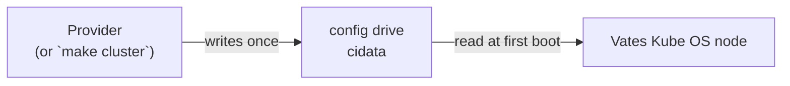
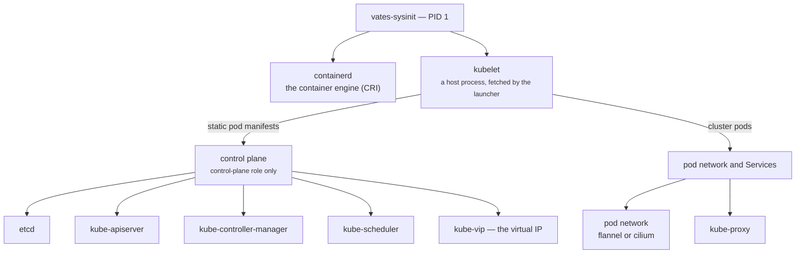
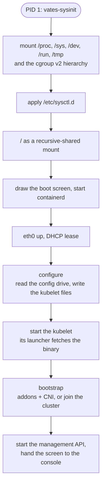

# Architecture

Vates Kube OS is a machine image whose only job is to run Kubernetes. This
document explains what it is, how a machine starts, and how the pieces fit
together. Read it top to bottom, or stop wherever you have what you need.

## What it is

An **immutable** image, built from pinned upstream sources: glibc, **no
systemd, no SELinux, no package manager**. Its only job is to run
**Kubernetes**: the kubelet is a **host process** started by PID 1, every
workload and every control-plane component is a container, and the init process
(PID 1) is this project's own binary, `vates-sysinit`.

Two ideas carry the whole design:

- the image is **frozen and identical everywhere** — one image serves every
  machine and every supported Kubernetes version;
- everything that makes a node *this* node comes from a **config drive** written
  by whoever creates the machine.

## The contract: one document

The machine receives a **config drive** (a small read-only disk labelled
`cidata`), and reads exactly two things from it:

| file | content |
|---|---|
| `meta-data` | NoCloud meta-data; its `local-hostname` is the **fallback** node name |
| the configuration | the node document, in the `user-data` slot or as a `vates-node.yaml` file — it may state the node name (`node.name`) and the PKI |

The node says which it read at boot (`config : user-data` or
`config : vates-node.yaml`). The document itself is the same YAML either way —
no wrapping, no cloud-init: this OS does not run cloud-init and reads no
cloud-init key.

Nothing else configures a node. The image knows nothing about the provider, and
the provider knows nothing about the image internals, so the two can evolve
separately.



## What runs on a machine



The important part: **PID 1 starts the kubelet as a host process**, and the
kubelet then starts everything else through containerd — the control plane from
static pod manifests, the rest as ordinary cluster workloads.

## Boot, step by step

`vates-sysinit` is PID 1. There is no systemd to order anything: this one program
runs the sequence and reaps its own children.



1. mount the pseudo filesystems and the cgroup v2 hierarchy;
2. apply `/etc/sysctl.d` (`ip_forward`, the bridge sysctls);
3. make `/` a recursive-shared mount, as systemd does at boot;
4. draw the boot screen and start **containerd**;
5. bring `eth0` up and take a DHCP lease;
6. run **configure**: read the config drive, write the kubelet's environment
   (its name, its address, the Kubernetes version, where to fetch it), and on a
   control plane generate the certificates and static pod manifests;
7. start the **kubelet** as a host process — `/usr/local/bin/kubelet` is a
   *launcher* that fetches and verifies the requested Kubernetes binary, then
   execs it;
8. run **bootstrap**: cluster addons and the CNI on the first control plane,
   `kubeadm join` on a joining one, nothing on a worker;
9. start the **management API** and hand the screen to the console.

## The pieces

| Piece | Role | Started by |
|---|---|---|
| `containerd` | container engine (CRI) | PID 1 |
| `kubelet` | the node agent | PID 1 (host process) |
| `etcd`, `kube-apiserver`, `kube-controller-manager`, `kube-scheduler` | control plane | kubelet (static pods) |
| `kube-vip` | holds the control plane's virtual address | kubelet (static pod) |
| `flannel` or `cilium`, and `kube-proxy` | pod network and Service rules | kubelet |
| `vates-sysinit` | PID 1, the boot sequence | the kernel |
| `vates-launcher` | fetch, verify and run a Kubernetes binary | the kubelet, kubeadm and kubectl (on the host) |
| `vates-api` | the management API | PID 1 |
| `vates-console` | the machine's screen | PID 1 |

The binaries, and why there are several of them instead of one:
[`BINARIES.md`](BINARIES.md).

## Two identities: a stable name, a moving address

Kubernetes identifies a node **by name**, so the name must never change while
the address may change on every DHCP lease:

| | value | changes? |
|---|---|---|
| node name | `node.name` in the document, or `local-hostname` from `meta-data` | **never** |
| address | DHCP lease | yes |

The kernel hostname is set to the node name, the kubelet gets
`--hostname-override` (the name) and `--node-ip` (the current address), and the
cluster endpoint is always the **virtual IP**, never a node's address.

## The node document

```yaml
role: worker                  # master (control plane) or worker

node:
  name: vates-cp-1            # optional; wins over the drive's meta-data

kubernetes:
  version: v1.31.0            # v1.31 or newer

cluster:
  controlPlaneEndpoint: "192.168.122.200:6443"
  token: "abcdef.0123456789abcdef"   # required for a worker
  vip:
    address: "192.168.122.200"  # control plane only

network:
  iface: eth0
  mode: dhcp                  # dhcp or static

cni:
  plugin: flannel             # flannel (default) | cilium | none
  cidr: "10.244.0.0/16"

dashboard:
  mode: gui                   # tui | gui — what the console shows
```

`node.name` states the name when the writer knows it — the CAPI bootstrap
provider does — and wins over the drive's `meta-data`; `local-hostname` stays the
fallback a hand-built drive uses. The document can also carry the **PKI**
(`pki.clusterCA` for the cluster authority, `pki.apiCA` for the management API),
which is how a provider that owns the CA hands it to a node with no file channel;
a bootstrapping control plane then **reuses** that CA instead of generating one.

`cni.plugin` selects the pod network the node installs at bootstrap: `flannel`
(the default, stated or not) and `cilium` (the agent and its operator, pinned
like every other component). Both are embedded manifests applied by the node
itself, both run alongside kube-proxy, and `cni.cidr` is the one field the pod
network reads — flannel from its own manifest, cilium from the node's podCIDR
annotation, which kubeadm writes from the same value. `none` installs nothing:
the CNI then comes from the cluster side, and the node stays NotReady until it
does.
Optional blocks (`registry`, `binaries`, `api`, `cloud`, `time`) cover air-gapped
clusters and a few deployment choices; the schema is in
[`vatescfg/config.go`](../vatescfg/config.go).

## One image, any Kubernetes version

The image embeds no Kubernetes binary. The host carries a **launcher**
(`/usr/local/bin/kubelet`, `kubeadm`, `kubectl`, `mounter` are all symlinks to
it); at first boot the node reads `kubernetes.version` from the document, fetches
the binary, verifies the published digest, caches it under `/var`, and runs it.
Binaries live in `/var` — the mutable half — which is exactly the immutability
split.

The **configuration** supports `v1.31` and newer, with **no upper bound**: the
floor is kubeadm's configuration API (`v1beta4` from 1.31), and a version below it
is refused when the file is read, not later on the machine. A ceiling would mean
rebuilding the image for every minor; if kubeadm ever stops reading `v1beta4`, the
incompatible version fails on the node with an error naming the field, and that is
when the bound is revisited. Tested through `v1.37`.

## Immutable, with an A/B update path

`/` is mounted read-only, `/var` is its own partition that only grows, and every
`/etc` path a node writes at runtime is a symlink into `/var`. The disk reserves
two root partitions (`rootA`, `rootB`) so an update can be written to the
inactive one and the next boot switched to it. Details, and what is still
planned: [`IMMUTABILITY.md`](IMMUTABILITY.md).

## The management API

A node has no shell and no SSH. The one way to ask it something is its
management API: gRPC over mutual TLS on port 50000, with a fixed set of methods
(status, kubeconfig, join material, boot slots, logs). No method runs a command.
See [`API.md`](API.md).

## Status

- [x] the image builds and boots; the kubelet talks to containerd
- [x] the node document schema, validated
- [x] configure a **worker** and a **control plane** (kubeadm + kube-vip)
- [x] a 3 + 3 test cluster over libvirt, etcd with 3 voters, VIP failover
- [x] one image, any Kubernetes version (v1.31 and newer, no ceiling)
- [x] the document carries the node name and the PKI; a bootstrapping control
      plane reuses an injected cluster CA
- [x] read-only root, `/var` on its own partition
- [x] A/B switchover and boot-counted rollback through the API
- [x] `make template`: the disk becomes a Xen Orchestra VM template
- [ ] the updater, `vateskctl ab update` (write the inactive root, then switch)
- [ ] image verification at update time (the verifier exists; the updater must
      call it). Verified boot (dm-verity) stays optional
- [ ] the CAPI provider (its node-side prerequisite — the injected CA — is in
      place)

## Where to go next

- build the image: [`BUILD.md`](BUILD.md)
- run a cluster: [`USAGE.md`](USAGE.md)
- talk to a node: [`API.md`](API.md)
- immutability in depth: [`IMMUTABILITY.md`](IMMUTABILITY.md)
- the binaries: [`BINARIES.md`](BINARIES.md)
